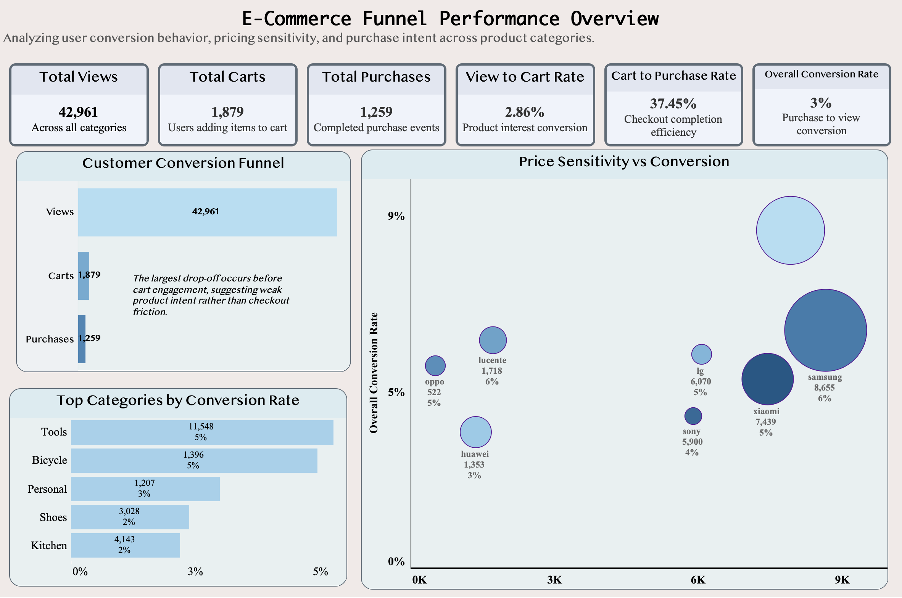
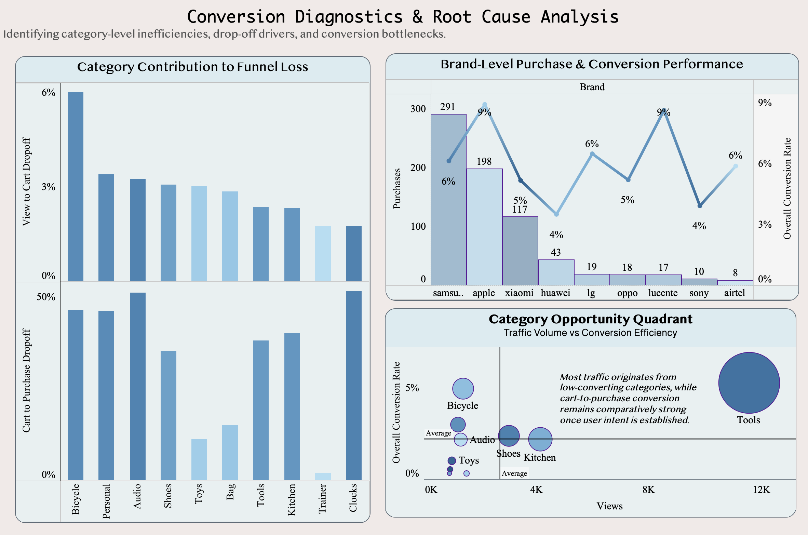

# E-Commerce Conversion Funnel Analysis

   
  

## Overview
Most e-commerce businesses assume their conversion problem lives at checkout. This project challenges that assumption.

Using real e-commerce event data covering 42,961 product views across multiple categories and brands, I built a two-page Tableau dashboard to trace exactly where users drop off, which categories are worth investing in, and why high-traffic products often generate the least revenue.

The short answer: 97% of users who view a product never buy it — and the drop happens long before checkout.

## Problem Statement

An e-commerce platform is seeing low overall purchase conversion despite high product view counts. The business needs to understand:

- Where exactly in the funnel are users dropping off?
- Which product categories attract traffic but fail to convert?
- Does price influence conversion rate — and if so, how strongly?
- Which brands are quietly outperforming despite low visibility?
- Where should the business focus its optimization effort first?

## Tools Used

- **SQL** - data extraction, funnel construction, aggregation, conversion rate calculation
- **Tableau** — dashboard design, KPI cards, funnel visualization, scatter plots, dual-axis charts, quadrant analysis
- **DB Browser for SQLite** — local SQL querying on raw dataset

## Data Overview

The dataset contains e-commerce user behavior events with the following fields:

* event_type — view, cart, or purchase
* category_code — product category hierarchy
* brand — product brand
* price — product price at time of event
* user_id — unique user identifier
* user_session — session identifier
* event_time — timestamp of event

Total records analyzed: 100,000 rows sampled from a larger behavioral dataset. All analysis performed on unique user-level events to avoid double counting.

## Data Preparation Notes

* Missing categorical values were retained and labeled as **“Unknown”** to preserve dataset completeness and avoid bias in segmentation analysis
* This allowed missing data itself to be analyzed as a meaningful segment in Tableau
* Data was cleaned and structured prior to visualization, ensuring consistent funnel-level aggregation

## Dashboard Overview

The analysis is split into two Tableau pages. Page 1 focuses on funnel performance, while Page 2 focuses on diagnostic and root-cause analysis.

## Page 1 — Funnel & Conversion Overview

**Key metrics at a glance:** Total Views: 42,961 | Total Carts: 1,879 | Total Purchases: 1,259 | View to Cart Rate: 2.86% | Cart to Purchase Rate: 37.45% | Overall Conversion Rate: ~3%

The number that matters most here is not the overall conversion rate — it is the gap between View to Cart (2.86%) and Cart to Purchase (37.45%). Once someone adds a product to their cart, they buy it more than a third of the time. The checkout experience is not the problem. Getting users to the cart in the first place is.

**Funnel behaviour** confirms this visually. The drop from 42,961 views to 1,879 carts is steep, while the step from cart to purchase is comparatively stable. This clearly indicates where focus should be: not checkout optimisation, but building stronger purchase intent earlier in the journey.

**Category performance** tells a different story than expected. Tools has the highest view count and the highest conversion rate among top categories at 5%. Kitchen has 4,143 views but converts at only 2%.

Traffic volume and conversion efficiency do not move together — meaning optimising for traffic alone is not enough.

**Price vs Conversion** — plotted as a bubble chart by brand — shows a clear directional pattern: as average price increases, conversion tends to drop. But it is not linear.

* Samsung averages ~8,655 per item and still converts at 6%
* Huawei sits at ~1,353 average price and converts at only 3%
* Lucente, with ~1,718 price and low exposure, still converts at 6%

Price matters, but brand trust significantly moderates it.

---

## Page 2 — Conversion Diagnostics & Root Cause Analysis

**Category drop-off contribution** breaks down which categories are responsible for the most funnel leakage:

* Bicycle contributes ~6% of total View → Cart drop-off (highest)
* Audio, Personal, and Shoes follow
* Cart → Purchase drop-off is more evenly spread (~45–52%)

Early-stage engagement varies significantly by category, while final purchase decisions are relatively consistent. This suggests the issue is not pricing or payment, but lack of intent formation at the product page level.

**Brand performance** shows Samsung leading purchase volume at 291 with ~6% conversion, followed by Apple at 198 purchases with similar conversion.

Lucente stands out with 17 purchases but ~9% conversion — the highest efficiency on the chart with very low traffic. Airtel shows a similar pattern.

**Category Opportunity Quadrant** maps categories by views and conversion rate, with bubble size representing purchase volume:

* Tools dominates with high views, strong conversion, and largest volume
* Bicycle sits in a high-conversion but low-visibility zone
* Toys and Trainer sit in low-impact zones (low views + low conversion)

## Key Business Insights

The core problem is intent formation, not checkout friction. A 2.86% View to Cart rate means most users leave without any meaningful action.

Tools is the strongest category across both traffic and conversion efficiency, making it the most scalable opportunity.

Lucente is a high-efficiency, low-traffic brand that could generate outsized returns if scaled through visibility improvements.

Bicycle shows strong post-cart conversion but weak early engagement, indicating product pages are not converting casual browsers into intent-driven users.

Price matters less than brand trust at mid-to-high ranges. The data shows brand perception plays a stronger role than price alone.

## Business Recommendations

Highest-leverage opportunity is improving View to Cart conversion, as small gains here significantly increase downstream revenue.

High-performing but underexposed brands like Lucente should be scaled through better placement and visibility.

Tools should receive increased strategic focus due to consistent performance across both traffic and conversion.

Bicycle requires improvements in product presentation to strengthen early funnel engagement.

Low-performing categories like Toys and Trainer should remain deprioritised until higher-impact areas are optimized.

---

## Limitations

The dataset is a 100K row sample and may not fully represent production behavior. No demographic, geographic, or marketing spend data was available, so interpretations are based on observed patterns rather than confirmed causation. Pricing does not account for discounts or promotions. Cart abandonment reasons cannot be directly inferred from event data.

## Skills Demonstrated

Funnel analysis, conversion rate optimization thinking, category and brand segmentation, pricing impact analysis, quadrant-based strategic prioritization, KPI design, SQL preprocessing, Tableau dashboard development across funnels, scatter plots, dual-axis charts, bubble charts, and data storytelling connecting visualization to business decisions.
